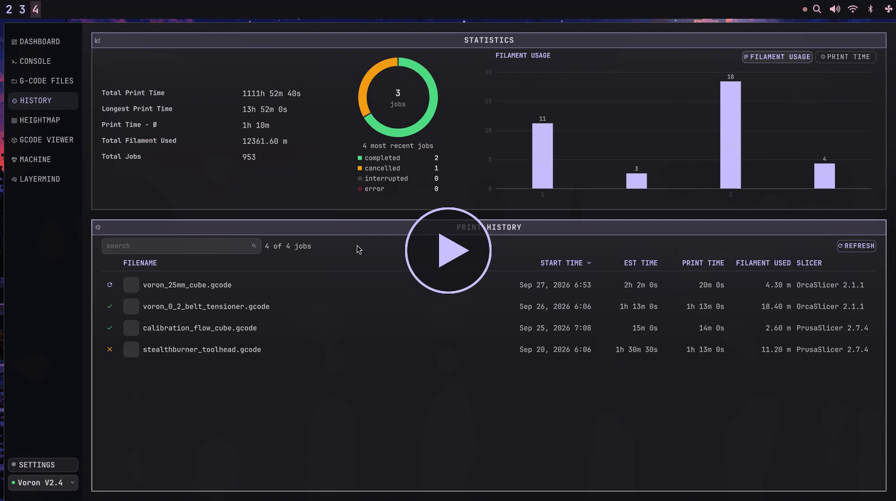
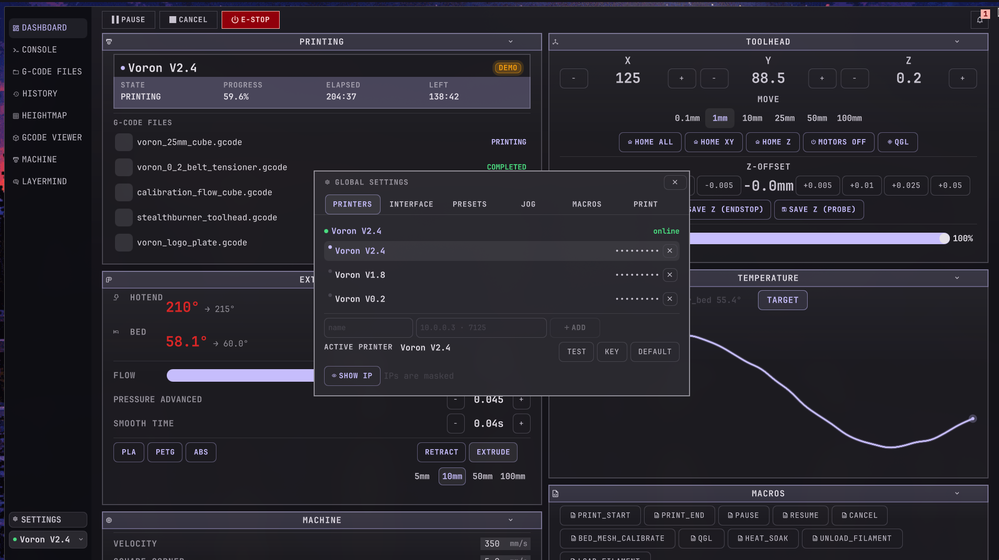
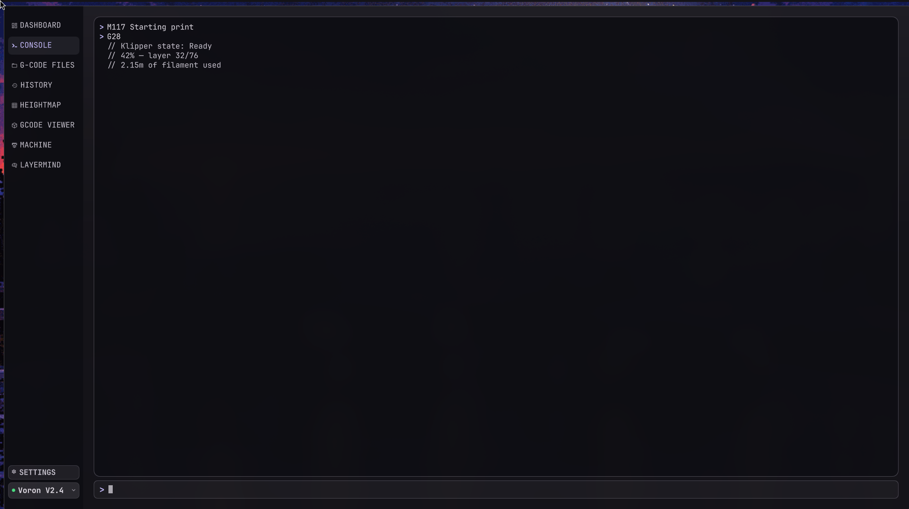
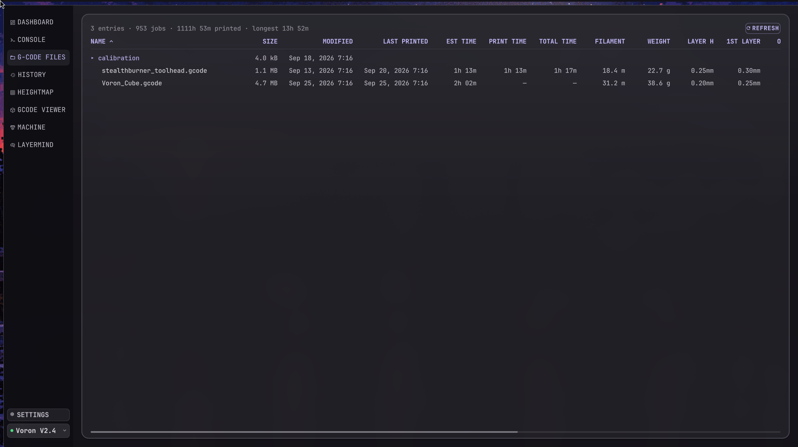
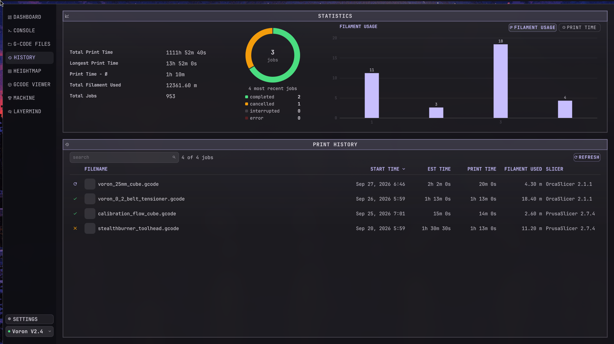
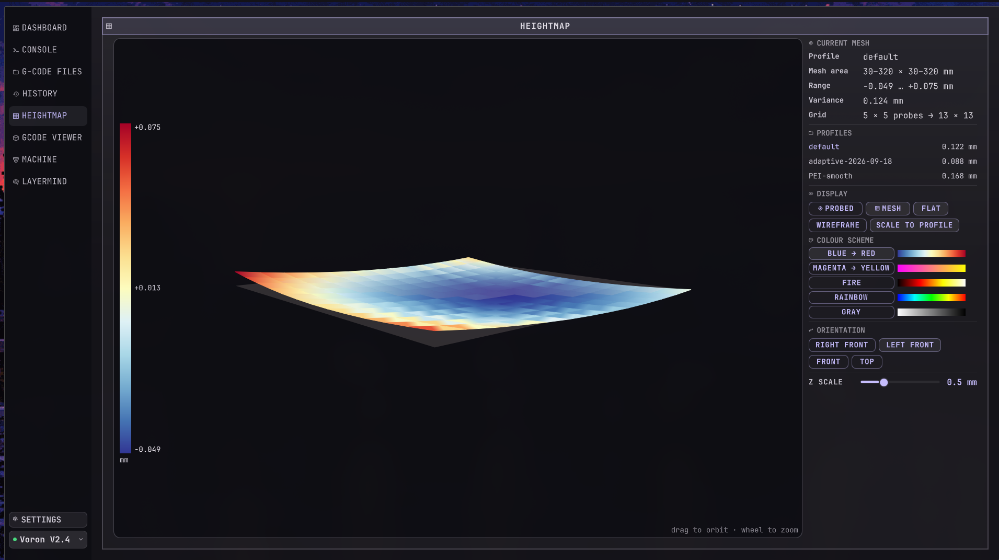
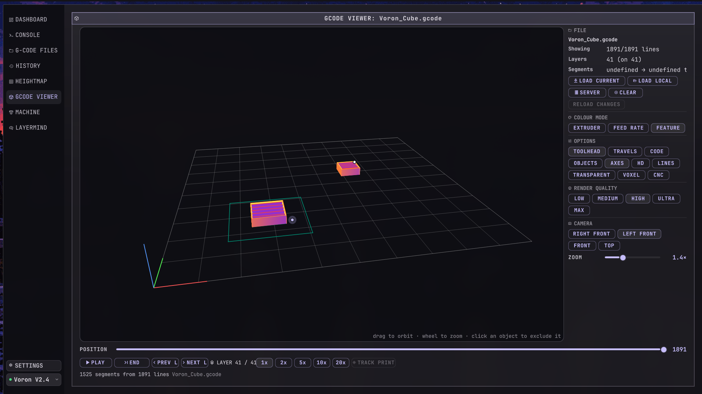
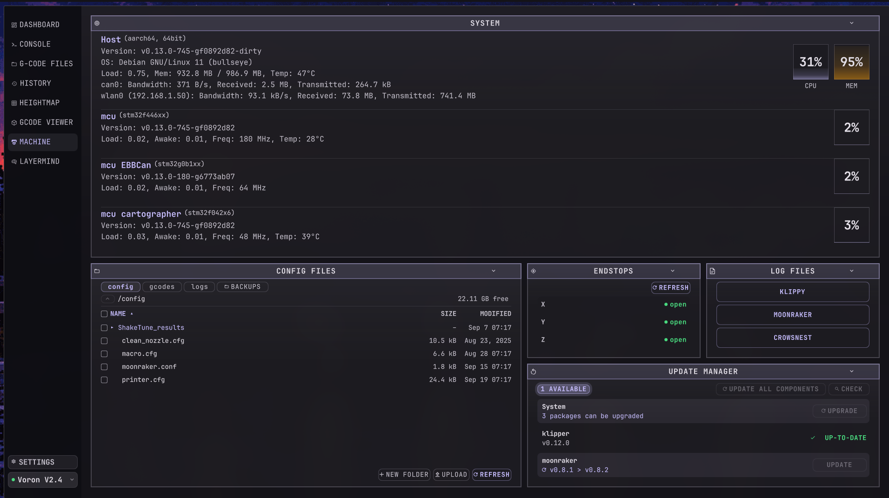
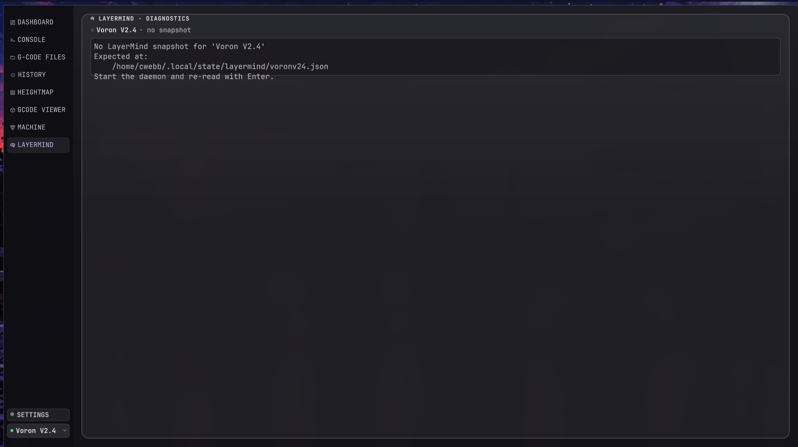

<div align="center">
  
</div>

<br>

<div align="center">
  
  
  
  
  
  
</div>

<br>

<div align="center">
  <table>
    <tr>
      <td align="center" width="150"><a href="#-views">Views</a></td>
      <td align="center" width="150"><a href="#-install">Install</a></td>
      <td align="center" width="150"><a href="#-keys">Keys</a></td>
      <td align="center" width="150"><a href="#-state">State</a></td>
      <td align="center" width="150"><a href="#-development">Development</a></td>
    </tr>
  </table>
</div>

<br>

---

klipshell is a desktop control surface for Klipper printers. It talks to
[Moonraker](https://moonraker.readthedocs.io/) over HTTP and puts eight views in
one keyboard-driven window: dashboard, GCode console, print files, history, bed
mesh, GCode viewer, machine health, and LayerMind diagnostics.

It's QML on [Quickshell](https://quickshell.org/), so there's no browser, no web
server and no Python daemon. One process, two dependencies: `quickshell` and
`curl`.

Colours come from [matugen](https://github.com/InioX/matugen), so the window picks
up the same Material You palette as the rest of the desktop.

<br>

---

## ✦ Screenshots

<div align="center">
  <a href="docs/video/klipshell-demo.mp4">
    
  </a>
  <br>
  <sub>Two-minute demo: console, history, bed mesh, GCode viewer, machine, LayerMind. Click to play.</sub>
</div>

<br>

<table>
  <tr>
    <td width="50%"><a href="docs/screenshots/dashboard.png"></a></td>
    <td width="50%"><a href="docs/screenshots/console.png"></a></td>
  </tr>
  <tr>
    <td><a href="docs/screenshots/gcode-files.png"></a></td>
    <td><a href="docs/screenshots/history.png"></a></td>
  </tr>
  <tr>
    <td><a href="docs/screenshots/heightmap.png"></a></td>
    <td><a href="docs/screenshots/gcode-viewer.png"></a></td>
  </tr>
  <tr>
    <td><a href="docs/screenshots/machine.png"></a></td>
    <td><a href="docs/screenshots/layermind.png"></a></td>
  </tr>
</table>

All eight views, captured mid-print on a Voron V2.4 at 1911×1071. Click any shot
for full resolution.

<br>

---

## ✦ Views

| # | View | What it does |
|:---:|------|------|
| `1` | **Dashboard** | Eight live cards: status, temperatures, toolhead, fans and flow, extruder, macros, host health, console. Cards reorder, hide and collapse from *Settings → INTERFACE → LAYOUT*. |
| `2` | **Console** | GCode transcript from `/server/gcode_store` with a keyboard input row. Type, `Backspace` to edit, `Enter` to send. |
| `3` | **G-CODE FILES** | Every column Mainsail shows (slicer, estimate, filament, layer height, temps) in one sortable, sideways-scrolling table. Read-only. |
| `4` | **History** | Session totals, job-status donut, filament and print-time bars, over a searchable job table. |
| `5` | **Heightmap** | Bed mesh as three stacked surfaces with a Z colour ramp and an orbitable camera. Canvas 2D, no echarts. |
| `6` | **GCODE VIEWER** | Scrubber, play to 20×, layer navigation, colour by extruder / feed rate / feature, five render qualities. |
| `7` | **MACHINE** | Host load rings, network, endstops, update manager, and the `config` / `gcodes` / `docs` browsers. Upload, rename, copy, delete, and edit a file in `$EDITOR`. |
| `8` | **LAYERMIND** | The [LayerMind](https://github.com/webbwerkx/LayerMind) daemon's per-printer snapshot. |

Clicking a file on the dashboard's status card starts a print, after a
confirmation. Pause, resume, cancel and E-STOP live in the header.

<br>

---

## ✦ Install

Needs Quickshell 0.3.1+, `curl`, and **JetBrainsMono Nerd Font Mono**: every
icon is a Nerd Font glyph. matugen is optional; without it the window falls back
to a baked-in warm scheme.

```fish
git clone git@github.com:CWebb89/Klipshell.git
cd Klipshell
./install.sh          # registers the matugen template, seeds the printer list
./launch.sh
```

Then edit `src/config/printers.json`:

```json
{
  "printers": [
    { "name": "Voron V2.4", "host": "192.168.1.50", "port": 7125 }
  ]
}
```

That file is gitignored: it holds real hosts and the printer editor writes back
to it in place. You can also add printers at runtime from *Settings → PRINTERS*,
where **TEST** reports the HTTP status of a candidate host.

<br>

---

## ✦ Keys

One key handler for the whole window.

| Key | Action |
|:---:|--------|
| `1`–`8` | Jump to a view |
| `↑` `↓` `←` `→` | Previous / next view |
| `H` `J` `K` `L` | Previous / next view |
| `Enter` | Refresh the active view |
| `Esc` | Close whatever is open: confirm dialog, settings, dashboard console, notifications, layout mode, then back to Dashboard |

<br>

---

## ✦ State

Everything is plain JSON you can read and hand-edit. Only the printer list lives
in the checkout.

| Path | Contents |
|------|----------|
| `src/config/printers.json` | Printer names, hosts, ports (gitignored) |
| `~/.local/state/klipshell/settings.json` | Jog steps, feedrates, macro order, API keys, default printer, poll interval, units, confirmations |
| `~/.local/state/klipshell/dashboard.json` | Card order, visibility, collapse |
| `~/.local/state/klipshell/presets.json` | Material temperature presets |
| `~/.local/state/klipshell/viewer.json` | GCode viewer toggles |
| `~/.local/state/layermind/<printer>.json` | Written by the LayerMind daemon, read-only here |

`MoonrakerService` polls on a timer (1 s default, 250 ms – 10 s) and normalises
the replies into buckets the views bind to. Nothing else in the project touches
the network, so swapping the poll for a WebSocket is one file.

<br>

---

## ✦ Development

```fish
./tools/verify.sh
```

The whole gate in one command: `qmllint`, shell syntax, the three test suites, and
a second qmllint pass that prints the warnings `--silent` hides. Per-step
PASS/FAIL/SKIP, exits 1 on any blocking failure. Individually:

```bash
bash -O globstar -c 'qmllint --silent shell.qml src/**/*.qml'
node src/gcode/test-parse.js          # GCode parser
node src/config/test-settings.js      # settings store logic
python3 tools/check-icons.py          # every icon glyph exists in the font
python3 tools/test-transport.py       # boots the real service against a stub Moonraker
./tools/snapshot.sh pre-refactor      # rollback net before a risky pass
```

`test-transport.py` runs the real `MoonrakerService` against a stub Moonraker on
a loopback port and asserts the JSON-RPC envelope handling and the signals views
listen to. It needs a Hyprland seat and skips without one.

`docs/HISTORY.md` is the engineering log, dated and chronological, including what
turned out to be wrong and the numbers that settled it. Grep it before changing
layout or an endpoint.

<br>

---

## ✦ Known issues

- Dashboard drag-to-reorder doesn't work. `_gridRects()` reads `globalPosition`
  off a `Column`, where it doesn't exist. The layout dialog is the working path.
- The GCode viewer is slow to load and its progress readout sticks at 0%.
- A wrong API key degrades to demo mode silently; two 401s are treated as an
  unreachable printer. Use *Settings → PRINTERS → TEST*.
- Transport is polled HTTP, not a WebSocket, so data lags by about a second.

<br>

---

## ✦ License

MIT. See [LICENSE](LICENSE).

<br>

<div align="center">
  <sub>Started as a port of <code>klip-tui</code>, a Rust terminal UI for the same printers.</sub>
</div>
